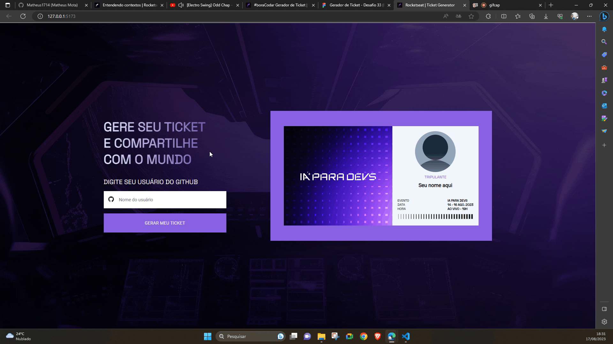

# [Generate Ticket Github Profile](https://ticket-generator-4u4j3iosn-matheus1714.vercel.app/) 🚀



This repository is the solution to [#boraCodar Gerador de Ticket](https://www.rocketseat.com.br/boracodar) by Rocketseat.

The objective of this project was to develop a page to generate personalized tickets through a GitHub public profile. In development I developed features beyond what was required.

## Design

This Front-end project was developed based on the design proposed in [Figma](https://www.figma.com/file/CSTKpUmeynJKA1Nwq44Hgt/Gerador-de-Ticket---Desafio-33-(Community)?type=design&node-id=3%3A377&mode=design&t=G3YtpME97TnpgN25-1).


## Features (implemented)

* check if profile on github exists ✅
* extract profile information ✅
* change layout to download the ticket ✅
* Download ticket to PNG ✅
* make responsive design for phone ✅
]
## Improvements (no implemented)

* recommend github profiles while writing 🔮

## Technologies

This project was developed using Vite + ReactJS, Typescript.

The project dependencies were:

```json
"dependencies": {
   "@phosphor-icons/react": "^2.0.10",
   "axios": "^1.4.0",
   "html2canvas": "^1.4.1",
   "phosphor-icons": "^1.4.2",
   "react": "^18.2.0",
   "react-dom": "^18.2.0",
   "react-loading-icons": "^1.1.0",
   "styled-components": "^6.0.7"
},
```

## Run Project

Run the installation of dependencies with:

```shell
npm i
```

Run the exe project using the command:

```shell
npm run dev
```

😝 Enjoy!!

## What I Learned with This Project?

### ContextAPI

During project development, my `Home` component got a lot of _props_ and information sharing got loaded. To solve this problem, which in react is called _prop drilling_, I used ContextAPI.

First I created the context to contain the properties I wanted to pass.

```ts
// src/contexts/TicketContext.tsx
interface TickerContextType {
  username: string
  loading: boolean
  findedUser: boolean
  success: boolean
  userData: UserData
  handleInputUsername: (username: string) => void
  handleForm: (event: FormEvent) => void
  handleDowloadTicket: () => void
}

export const TicketContext = createContext({} as TickerContextType)

```

Then I created the provider with the elements I needed.
```ts
// src/contexts/TicketContext.tsx

export function TicketContextProvider({
  children,
}: TicketContextProviderProps) {
   ...
   return (
    <TicketContext.Provider
      value={{
        username,
        loading,
        findedUser,
        success,
        userData,
        handleInputUsername,
        handleForm,
        handleDowloadTicket,
      }}
    >
      {children}
    </TicketContext.Provider>
  )
}
```

For the application to be cleaner, I could use `reducer`, but since there weren't many features, I decided to just develop it in this state.

### Axios

I used axios to perform github requests using the url `https://api.github.com/users`.

```ts
// src/services/github-api.ts

import axios, { AxiosInstance } from 'axios'

export interface UserData {
  login?: string
  name?: string
  avatar_url?: string
  error?: boolean
}

const api: AxiosInstance = axios.create({
  baseURL: 'https://api.github.com/users',
})
```

To get the user informations, I just needed to go to `https://api.github.com/users/required_user`.

```ts
// src/services/github-api.ts
const response = await api.get<UserData>(`/${username}`)
```

### Loading Page

I learned how to load a request using states.

```tsx
// src/contexts/TicketContext.tsx
async function handleForm(event: FormEvent) {
   event.preventDefault()
   setLoading(true)
   const user: UserData = await getUserInfo(username)
   setLoading(false)
   ...
}
```

```tsx
// src/components/Button/index.tsx
<S.WrapperButton>
{loading ? (
   <button disabled>
      <LoadingIcons.TailSpin fontSize={24} />
   </button>
) : (
   <button type="submit">GERAR MEU TICKET</button>
)}
</S.WrapperButton>
```

### Download Image

I was able to download the image using html2canvas.

It turned out pretty simple, but that's what I managed to do at my current level.

```ts
// src/contexts/TicketContext.tsx
function handleDowloadTicket() {
   const ticketHTML: HTMLElement | null = document.querySelector('#capture')
   if (ticketHTML) {
   html2canvas(ticketHTML).then((canvas) => {
      document.body.appendChild(canvas)
      const imgData = canvas.toDataURL('image/png')
      const a = document.createElement('a')
      a.href = imgData
      a.download = 'ticket-ia-para-devs.png'
      a.click()
   })
   }
}
```

## Acknowledgment

Thanks to [Rocketseat](https://www.rocketseat.com.br/).🚀
